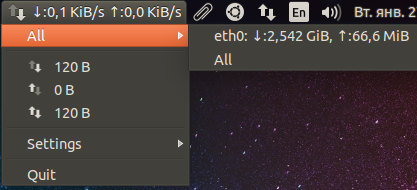

Network speed indicator for Loki
=================================

Elementary OS (Loki) implementation of Network speed Unity with ping's response time.



Usage
-----

```
sudo apt-get install build-essential libgtop2-dev libgtk-3-dev libappindicator3-dev git-core
git clone https://github.com/GGleb/indicator-netspeed-unity.git
cd indicator-netspeed-unity
make
sudo make install
indicator-netspeed-unity &
```

Deb
-----

```
sudo apt-get install fakeroot dpkg-dev
delete line (	glib-compile-schemas $(DESTDIR)/usr/share/glib-2.0/schemas/ ) in Makefile
dpkg-buildpackage -rfakeroot -b

```

PPA
-----

```
sudo apt-add-repository ppa:fixnix/netspeed
sudo apt-get update
sudo apt-get install indicator-netspeed-unity

```

The indicator will be put left of all your other indicators. If this is undesirable, the ordering
index can be changed in gsettings:/apps/indicators/netspeed-unity (use dconf-editor).

Add language
-------
https://translations.launchpad.net/netspeed-appindicator

Credits
-------

Originally written by Marius Gedminas <marius@gedmin.as>

Contributors:

- Tobias Brandt <tob.brandt@gmail.com>
- Stefan Bethge (stefan at lanpartei.de)
- Gleb Golovachev <golovachev.gleb@gmail.com>

